# PanchayatGuard

**Transparent Panchayat. Stronger Bharat.**
A production-quality government-tech procurement intelligence platform designed to monitor procurement activities, detect anomalies, and ensure transparent governance across Gram Panchayats.

## 🏛️ Architecture

PanchayatGuard is built as a modern, full-stack web application:
- **Frontend**: React 18, Vite, TypeScript, Tailwind CSS, Recharts (Data Visualization), Leaflet (Mapping)
- **Backend**: FastAPI (Python), SQLAlchemy 2.0 (ORM)
- **Database**: PostgreSQL (Production) / SQLite (Local Development Fallback)
- **Authentication**: JWT, bcrypt password hashing, Role-Based Access Control (RBAC)
- **Intelligence Engine**: Deterministic rule-based risk evaluation pipeline analyzing vendor concentration, price anomalies, and transaction splitting.

## 📸 Application Screenshots & Walkthrough

PanchayatGuard provides a comprehensive procurement intelligence dashboard designed to monitor public expenditure, identify procurement risks, analyze vendors, and improve transparency across Gram Panchayats.

### 1. 🔐 Login & Authentication

The secure login interface provides authenticated access to the PanchayatGuard platform. It supports administrator and official access while maintaining a clean, government-oriented interface.

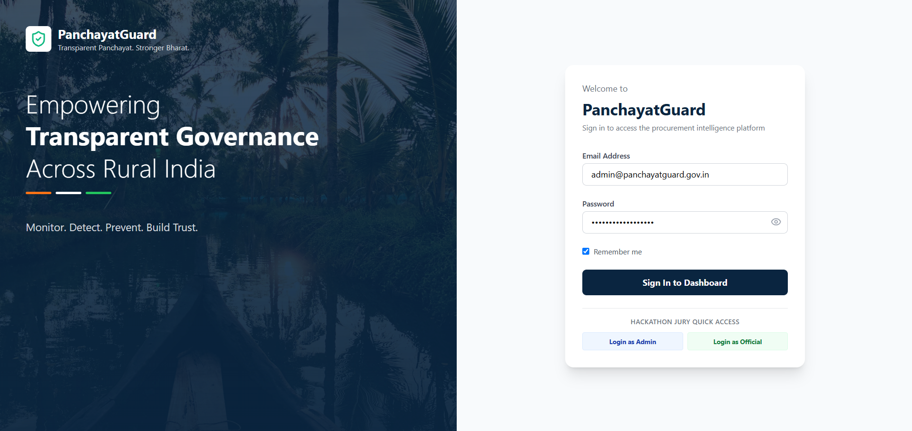

---

### 2. 📊 Dashboard

The central dashboard provides an overview of procurement activities across Gram Panchayats. It displays total procurement value, analyzed transactions, high-risk alerts, recent insights, and flagged transactions.

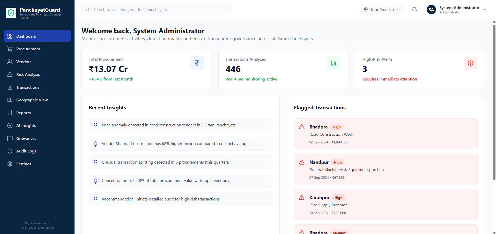

**Key features:**
- Total procurement overview
- Transaction monitoring
- High-risk alerts
- Recent AI-generated insights
- Flagged procurement transactions
- Real-time monitoring indicators

---

### 3. 🧾 Procurement Management

The Procurement Management module enables administrators to track and analyze procurement transactions using multiple filters such as district, Panchayat, category, vendor, date range, and risk level.

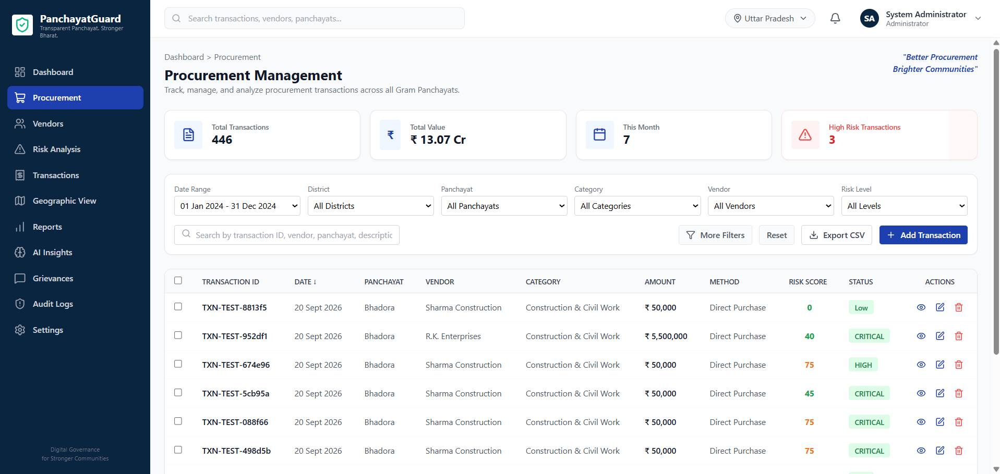

**Key features:**
- Transaction management
- Advanced filtering
- Vendor and Panchayat filtering
- Risk score visualization
- Transaction status tracking
- CSV export
- Add and manage transactions

---

### 4. 🏢 Vendor Management

The Vendor Management module provides an overview of registered vendors, their procurement value, categories, risk scores, and current status.

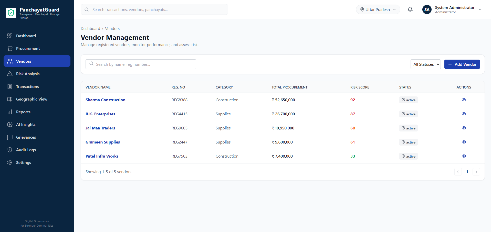

**Key features:**
- Vendor registration
- Vendor search
- Procurement value tracking
- Vendor risk scoring
- Vendor status monitoring
- Vendor profile access

---

### 5. ⚠️ Procurement Risk Analysis

The Risk Analysis dashboard identifies and visualizes procurement risks using the platform's deterministic risk evaluation engine.

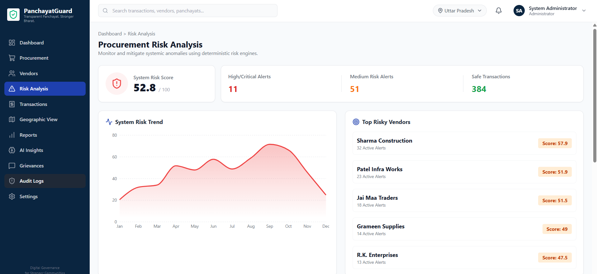

**Key features:**
- System-wide risk score
- High and critical risk alerts
- Medium-risk alerts
- Safe transaction count
- Risk trend visualization
- Top risky vendors
- Vendor-level risk scores

---

### 6. 💳 Transaction Monitoring

The Transactions module provides detailed transaction-level visibility across Panchayats, vendors, procurement categories, amounts, payment methods, and risk scores.

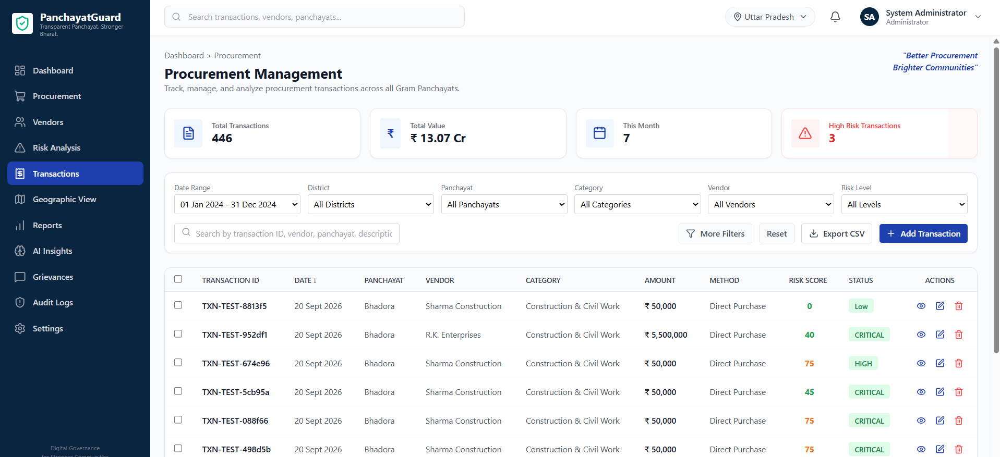

**Key features:**
- Transaction ID tracking
- Date and Panchayat information
- Vendor details
- Transaction amount
- Procurement method
- Risk score
- Transaction status
- View, edit, and delete actions

---

### 7. 🗺️ Geographic View

The Geographic View provides a map-based visualization of procurement activity and risk levels across Gram Panchayats.

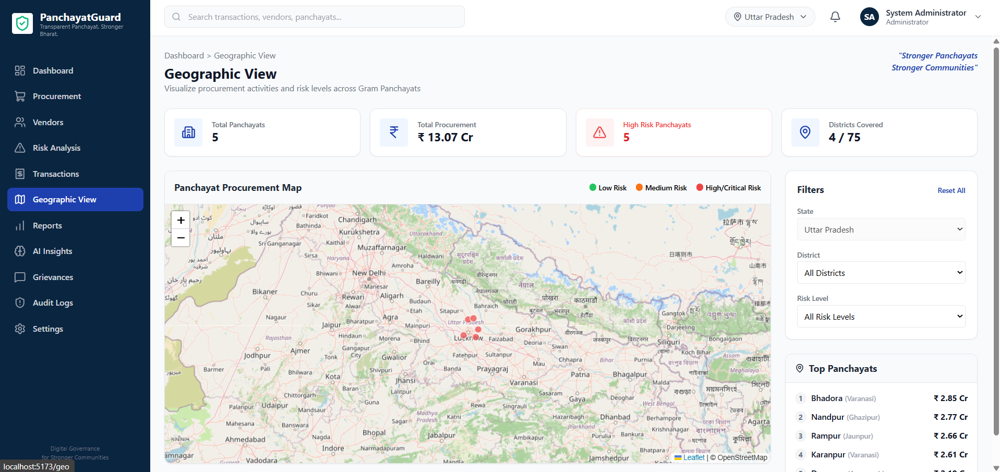

**Key features:**
- Panchayat procurement map
- Risk-level visualization
- State and district filtering
- Panchayat-wise procurement values
- Geographic risk monitoring
- OpenStreetMap-based visualization

---

### 8. 📑 Reports & Exports

The Reports module enables administrators to generate customized procurement and compliance reports based on selected criteria.

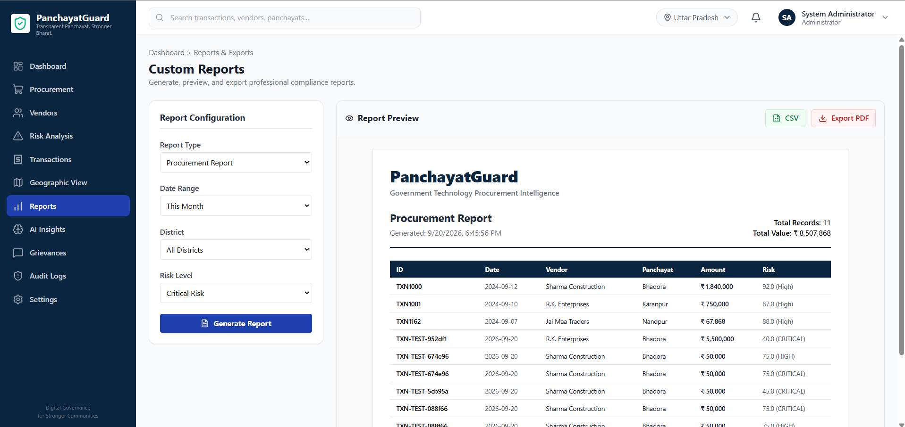

**Key features:**
- Custom report configuration
- Date-range selection
- District filtering
- Risk-level filtering
- Report preview
- CSV export
- PDF export
- Procurement summary

---

### 9. 🤖 AI Insights

The AI Insights module identifies suspicious procurement patterns and highlights potential anomalies for further investigation.

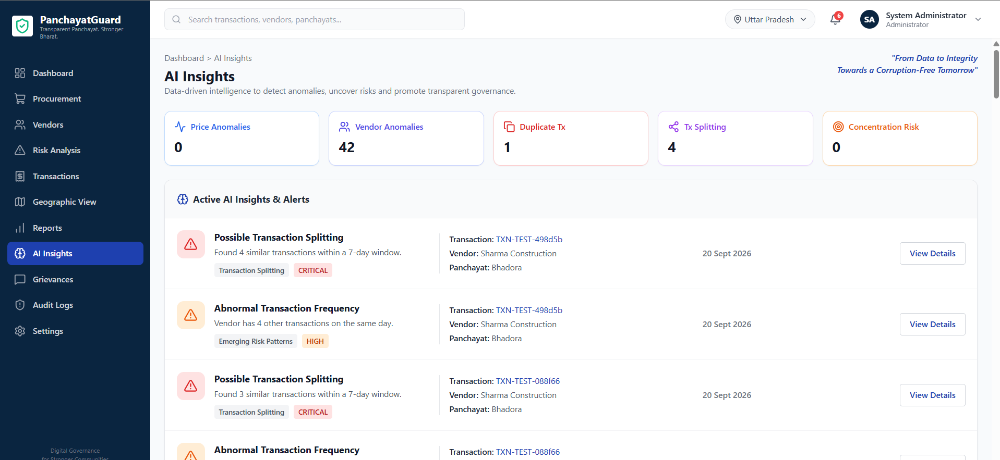

**Key features:**
- Price anomaly detection
- Vendor anomaly detection
- Duplicate transaction detection
- Transaction splitting detection
- Concentration risk analysis
- Active risk alerts
- Transaction-level insight details

---

### 10. 📝 Grievance Redressal

The Grievance Redressal module enables administrators to manage and track procurement-related public and internal grievances.

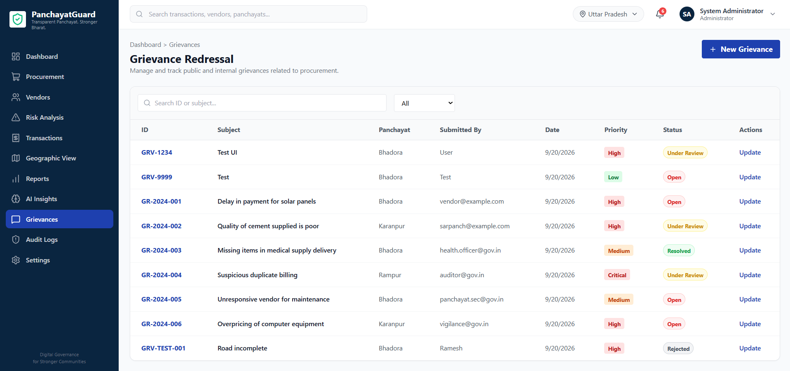

**Key features:**
- Grievance registration
- Grievance search
- Priority classification
- Status tracking
- Panchayat-level grievance management
- Grievance updates and resolution tracking

---

### 11. 🛡️ System Audit Logs

The Audit Logs module maintains a chronological record of system activities and administrative actions, improving accountability and traceability.

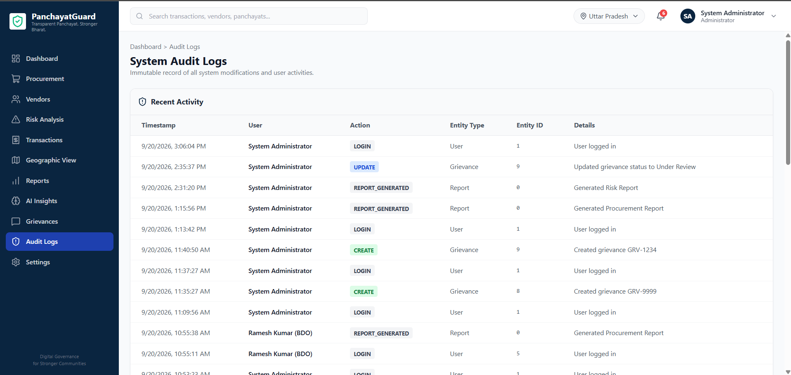

**Key features:**
- User login tracking
- Create and update activity tracking
- Report generation logs
- Grievance activity tracking
- Entity and action identification
- Timestamped system records

## 🔄 End-to-End Platform Workflow

Authentication
      ↓
Dashboard
      ↓
Procurement Monitoring
      ↓
Vendor Analysis
      ↓
Risk Analysis
      ↓
AI-Powered Insights
      ↓
Geographic Risk Visualization
      ↓
Reports & Exports
      ↓
Grievance Redressal
      ↓
Audit Logs

## 🚀 Installation & Setup

### Prerequisites
- Node.js (v18+)
- Python (3.10+)
- PostgreSQL (Optional for local, required for production)

### Backend Setup
1. Navigate to the `backend` directory:
   ```bash
   cd backend
   ```
2. Create and activate a virtual environment:
   ```bash
   python -m venv venv
   source venv/bin/activate  # On Windows use: .\venv\Scripts\activate
   ```
3. Install dependencies:
   ```bash
   pip install -r requirements.txt
   ```
4. Setup environment variables (copy `.env.example` to `.env`).
5. Run the server (auto-initializes SQLite if PostgreSQL isn't provided):
   ```bash
   uvicorn app.main:app --reload
   ```

### Frontend Setup
1. Navigate to the `frontend` directory:
   ```bash
   cd frontend
   ```
2. Install dependencies:
   ```bash
   npm install
   ```
3. Run the development server:
   ```bash
   npm run dev
   ```

## 🧪 Testing
Run end-to-end local testing using the following command inside the `backend` directory:
```bash
pytest
```
For the frontend, you can verify TypeScript constraints:
```bash
npm run build
```

## 🌍 Environment & Deployment
A `docker-compose.yml` file is provided for immediate production deployment. It spins up:
1. `db`: PostgreSQL 15 Database
2. `backend`: FastAPI Python server
3. `frontend`: Nginx serving the React build

**To deploy using Docker:**
```bash
docker-compose up --build -d
```

## 📜 API Documentation
FastAPI automatically generates interactive OpenAPI documentation. Once the backend is running, visit:
- Swagger UI: `http://localhost:8000/docs`
- ReDoc: `http://localhost:8000/redoc`

## 🛡️ Security Audit
- **JWT Authentication**: Implemented securely with environment-driven secrets.
- **SQL Injection**: Prevented globally by SQLAlchemy ORM parameterized queries.
- **CORS**: Strictly defined within `main.py`.
- **Sensitive Data**: Passwords hashed via `passlib[bcrypt]`.

## ?? Workflow & Screenshots

Explore the platform's features and user interface through the screenshots below:

### Login


### Dashboard


### Procurement


### Vendors


### Risk Analysis


### Transactions


### Geographic View


### Reports


### AI Insights


### Grievances


### Audit Logs


